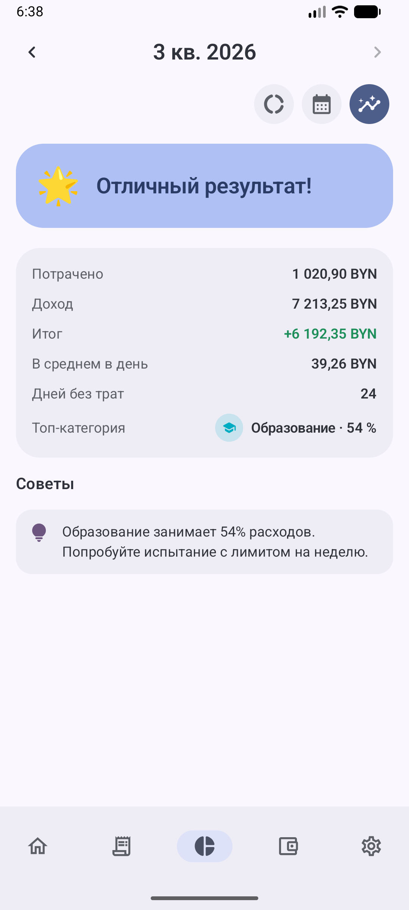
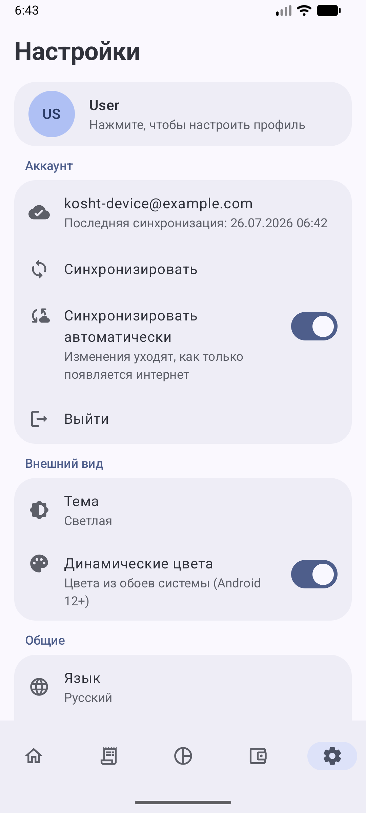

# 💚 Kosht — Personal Finance, Done Right

**Track spending in seconds. See where your money goes. Actually save.**

Kosht is a beautifully crafted personal finance app for Android that turns money tracking from a chore into a habit you'll enjoy. No subscriptions, no ads, and nothing you have to sign up for — an account exists only if you want the same figures on a second phone.

---

## ✨ Highlights

<table>
  <tr>
    <td align="center"> <b>Everything at a glance</b></td>
    <td align="center"> <b>Add a record in 3 taps</b></td>
    <td align="center"> <b>Powerful history & filters</b></td>
  </tr>
  <tr>
    <td align="center"> <b>Charts that make sense</b></td>
    <td align="center"> <b>Spending heatmap calendar</b></td>
    <td align="center"> <b>Monthly report & tips</b></td>
  </tr>
  <tr>
    <td align="center"> <b>Streaks, challenges, badges</b></td>
    <td align="center"> <b>Debts, savings & live FX</b></td>
    <td align="center"> <b>Make it truly yours</b></td>
  </tr>
</table>

<b>☀️ The same app in light theme</b>

<table>
  <tr>
    <td align="center"> <b>Home</b></td>
    <td align="center"> <b>Charts</b></td>
    <td align="center"> <b>Heatmap</b></td>
  </tr>
  <tr>
    <td align="center"> <b>Report</b></td>
    <td align="center"> <b>Wallet</b></td>
    <td align="center"> <b>Settings &amp; account</b></td>
  </tr>
</table>

---

## 🚀 Key Features

### ⚡ Lightning-fast expense tracking
A clean editor, smart category carousel and haptic feedback make adding a transaction take literal seconds. Attach a photo of the receipt to any expense.

### 🧮 Calculator, zero taps away
Adding a record drops you straight into a roomy bottom-sheet calculator — the editor itself stays uncluttered, and tapping the amount brings it back any time. Type `12,50+3,90+8`, hit the smart **=** to evaluate (with proper operator precedence), and **Apply** writes the sum into the amount field.

### 💳 Multiple accounts
Cards, cash, whatever you use. One account by default keeps the app dead simple; add more and Kosht unlocks per-account balances on Home, an account picker in the editor, an account choice when confirming a recurring payment and an account filter in Statistics. Tap an account to set its real balance, or use the pencil to rename it and change its icon and color.

### 📸 Receipt scanning — QR first, OCR always
Snap a receipt and Kosht reads the total, date and store for you.

- **QR codes come first.** Shops that print one hand over exact figures instead of guessed ones — and on the short slips that carry nothing but a QR, it is the only thing there is to read. The electronic receipt behind the code is fetched and kept, so it opens later even with no connection.
- **A code is only trusted once it proves itself.** Loyalty cards, Wi-Fi passwords and adverts share the same square shape; a payload counts as a receipt only when it carries fiscal fields or leads to a page an amount can actually be read from.
- **No QR, no problem.** The photo goes through on-device recognition instead — 100% offline, nothing uploaded.
- **The shop is read, not guessed.** A familiar chain is matched by name; an unfamiliar one is found the way a person finds it — the largest print at the top of the slip, a trade name in quotes, a legal form, the line beside the tax number. Addresses, cashiers, document headers and scanning noise are ruled out, and when nothing looks like a name the note is left empty rather than filled with a random line from the receipt.

Either way a review dialog shows what was read, and every field stays editable before you save.

### ☁️ Your money on every device — only if you ask
Sign up and records, categories, accounts, debts, goals, challenges and awards live in the cloud too, so a second phone shows the same figures the moment you sign in there.

Signing up is an email, a six-digit code that Kosht mails you (good for five minutes, counted down on screen), and a password — set only once the address is proven. Forgot it? The same code sets a new one. Address already taken, address unknown, wrong password, expired code: each says what happened and offers the door that fits.

- **Per-record merge.** Two phones edited offline both keep their work; "newest wins" only ever applies within one and the same record.
- **Deletions travel too**, so something you removed on one device does not come back from the other.
- **Offline is the normal case.** Keep adding records with no connection — everything goes up the moment the internet returns.
- **Settings → Account** is one row: the address, when it last synced, and a sync button that turns into a spinner while it works. Tap the row for the full address, the exact time and the state of automatic sync.
- **Your settings travel too** — currency, theme, interface and notification switches, the daily budget, the report you built and your name and nickname, so a second phone looks and behaves like the first. The interface language stays with the device.
- **Receipt photos stay on the device unless you say otherwise.** Switching *Sync receipt photos* on is a consent of its own, recorded as one: the images then live in a private bucket in your own folder, which no other account can read, write or delete. Switching it off deletes the uploaded copies and keeps the originals here.

### 📊 Statistics three ways
- **Charts** — an animated category donut and daily spending bars
- **Calendar heatmap** — instantly spot your expensive days
- **Report, on your terms** — set the window (week, month, quarter, year) and the visible metric rows once in Settings, then just walk back through past periods with the arrows; every metric is compared with the previous period of the same length. Plus personalized rule-based tips ("Groceries take 45% of spending — try a weekly limit challenge")

### 💱 Multi-currency done right
- **Live official rates** from the National Bank, refreshed automatically or by hand — with the update time always visible
- Amounts in foreign currency show their **BYN equivalent everywhere**: debts, savings, recurring charges
- Every expense **freezes the rate at the moment you paid**, so history never drifts when rates move
- **Switch the app currency** and the whole app follows at the live rate in one tap: records, the daily budget, balance corrections, challenge limits, savings, goals, debts and recurring charges — including the ones entered in a third currency, which cross through BYN. Frozen historical equivalents stay untouched, and a currency the National Bank does not publish is left alone rather than multiplied by nothing (or turn auto-convert off — your choice)
- Foreign-currency recurring payments let you set the **exact rate you were charged**

### 👛 The Wallet
- **Debts** — who owes whom, in any currency, with partial repayments
- **Savings** — a journal of every "set aside" moment, with per-currency totals
- **Savings goals** — name a goal, set a target, watch the progress bar fill 🎉
- **Recurring payments** — pick the charge date and frequency; nothing is charged silently, you always confirm. Foreign-currency charges let you set the exact rate, and with several accounts you pick which one to pay from.

### 🏆 Gamification that helps, not annoys
- **Under-budget streak** — days in a row you stayed within your daily budget (auto-calculated or set your own)
- **Custom challenges** — "spend under 100 on eating out this week", "no-spend weekend", "save 200 this month" — you configure, Kosht tracks, and a tap re-opens any challenge for editing
- **30 awards**, from first steps to a year inside the budget, laid out as swipeable pages — a thousand records, five thousand saved, a perfect month without a single day over budget, three months in a row in the black, twenty challenges completed. Tap one to see how to earn it, how far along you are ("6 / 10"), and the day you earned it — once earned, it is yours forever
- **You hear about it when it happens.** An award unlocks the moment it is deserved, whatever screen you are on: a congratulation appears over the app and a quiet note lands in the shade. No screen to go and check

### 🔔 Smart notifications (all optional)
An evening nudge only if nothing is logged, recurring payments awaiting confirmation, a Monday money digest, and awards as you earn them. All of them are quiet by design — no heads-up popups, no forced sound — and a tap takes you straight into the app.

### 🎨 Made for you
Light & dark themes, Material You dynamic colors, English & Russian interface, a profile with photo or built-in avatars — and interface toggles to hide anything you don't need. Without an account nothing ever leaves the phone; with one, only you can read it.

### 🔒 Consent you can actually withdraw
Collecting an email address makes this an operator of personal data under the Belarusian law of 07.05.2021 No. 99-З, and the app is built to match rather than to look like it does.

- **The Terms and the Personal data policy** are real documents, shipped as PDFs and kept where the app they describe is — Settings → About, alongside the manual. A tap writes the PDF into your phone's Downloads and opens it, so it stays yours to read, print or forward, and the same links sit on the sign-up form before you agree to anything.
- **Consent is an append-only ledger**, not a flag. What has to be provable is when someone agreed and to which wording, so nothing in it can be updated or deleted — not even by the account that owns it.
- **Advertising consent is separate, unticked, and never a condition** of having an account. Switch it off in Settings or from the unsubscribe link, which works without signing in.
- **Every right is where you would look for it**: the documents under About, the mailing switch among the notifications, and *Delete account and data* at the foot of the Account block — with a confirmation, because it cannot be undone. A copy of everything held about you is served on request to the address in the policy, within fifteen days.

### 📖 Learn it in minutes
An illustrated **guide lives right inside Settings**, and a full **PDF manual** with screenshots is one tap away — it downloads to your phone rather than just flashing up (also in [`docs/MANUAL.pdf`](docs/MANUAL.pdf)).

---

## 📦 Download & Updates

Every push to `master` automatically builds a fresh APK, and Kosht updates itself.

Tap **Settings → Version**: it either confirms you are up to date or **downloads and installs the update without leaving the app** — no browser, nothing left behind in Downloads, and your records stay exactly where they are. Android asks once for permission to let Kosht install its own updates; offline the check simply says it is unavailable. Builds are still on the **[Releases](../../releases)** page if you prefer to grab them by hand.

> Every published build is signed with the same key, and CI refuses to publish one that is not. An update signed differently is one Android will not install over the old app — Kosht now says so plainly instead of failing with a system error.

Requires Android 8.0+.

*See [PUBLISHING.md](PUBLISHING.md) for the Google Play / AppGallery release guide.*
