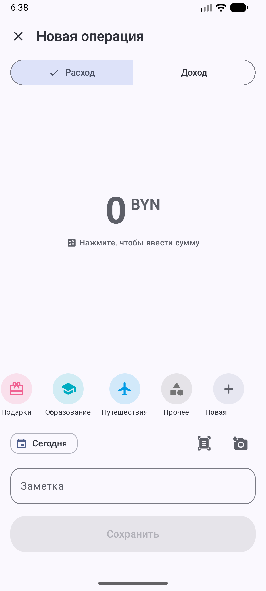
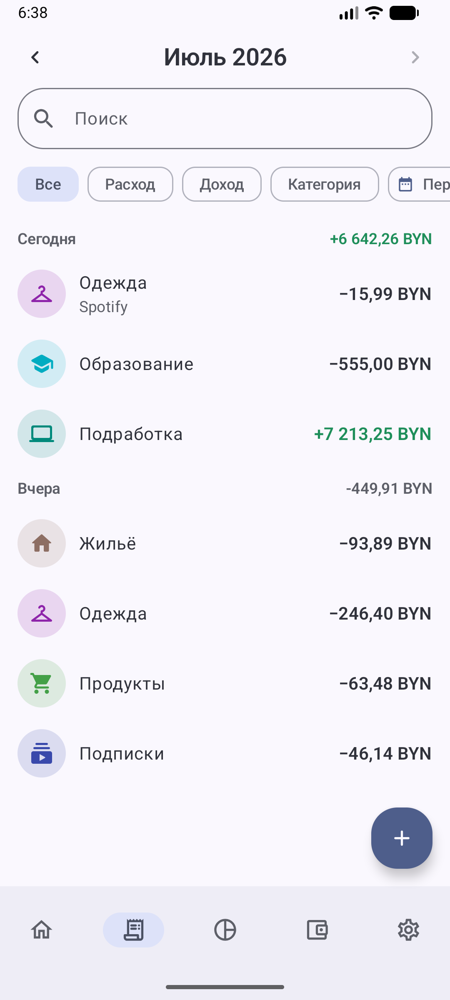
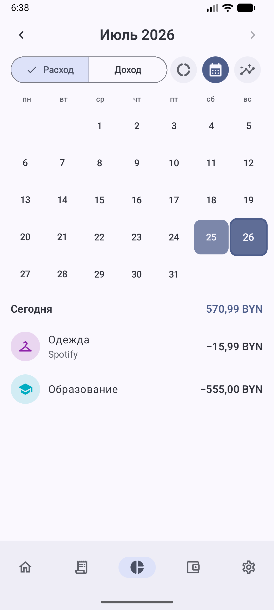
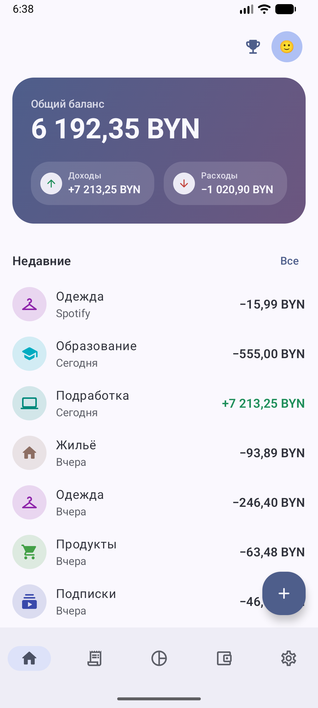
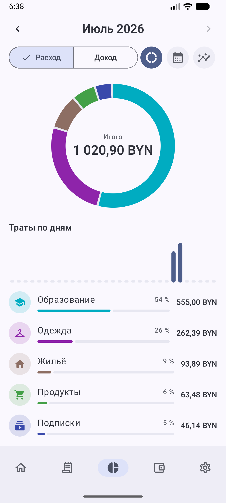
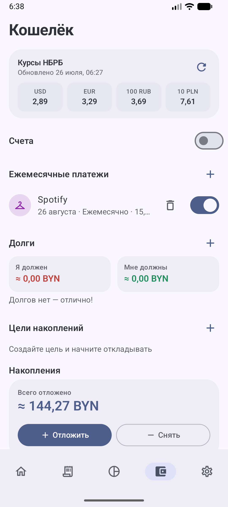
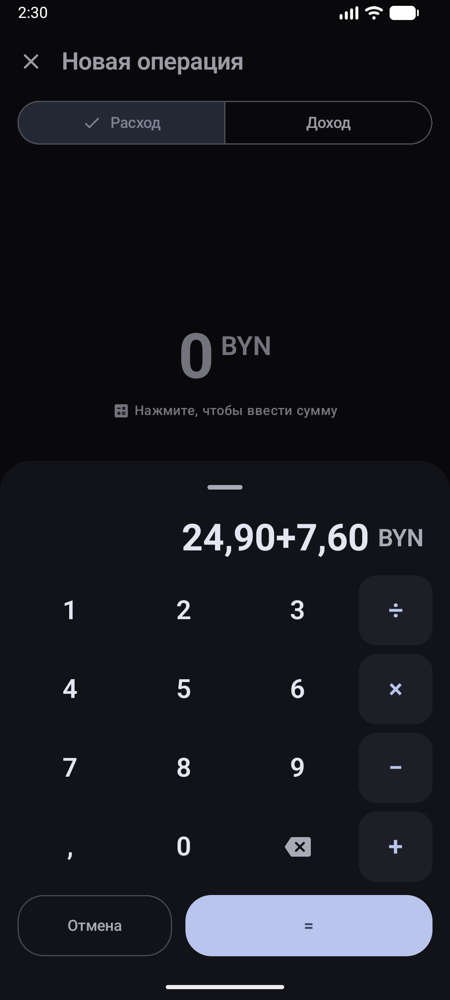

# Kosht

### Money tracking that takes seconds — and never leaves your phone

Snap a receipt, get a record. See where the month went. Save on purpose.
No ads, no subscriptions, no account unless you want one.

---

## 📸 Photograph a receipt. Get a record.

The total, the shop, the date and the shopping list fill themselves in — then stay editable.
A QR code hands over exact figures; without one, two offline recognisers read the paper.
Our own **119 KB model**, trained on Belarusian slips, decides what each line is.
Nothing is uploaded: no keys, no services, no cloud.

---

## ✨ Why people keep using it

|  |  |
|---|---|
| ⚡ **Three taps, no friction** The calculator opens with the record. Type `12,50+3,90`, pick a category, save. | 🧺 **What the money was for** Items inside a record — from a receipt or by hand — turn a category into an answer. |
| 💱 **Currencies that stay honest** Official NBRB rates, a BYN equivalent everywhere, and the rate you paid frozen into history. | 👛 **A wallet, not just a ledger** Accounts and transfers, debts with repayments, savings, goals, planned payments you confirm. |
| 🏆 **Habits, gently** An under-budget streak, challenges you set yourself, 44 awards that arrive on their own. | 📊 **Statistics that answer back** A donut and a daily chart that name what you tap, plus a heatmap of your expensive days. |
| 🔐 **A lock of your own** A 4–8 digit code that is never stored in the clear, plus fingerprint entry and slower guessing. | ☁️ **Two phones, one truth** Optional account: per-record merge, deletions travel, offline is the normal case. |

---

## 👀 See it — in both themes

<table>
  <tr>
    <td align="center"> <b>Add in seconds</b> ☀️ light</td>
    <td align="center"> <b>History that keeps up</b> ☀️ light</td>
    <td align="center"> <b>Heatmap of the month</b> ☀️ light</td>
  </tr>
  <tr>
    <td align="center"> <b>Charts that answer a tap</b> 🌙 dark</td>
    <td align="center"> <b>Streak &amp; challenges</b> 🌙 dark</td>
    <td align="center"> <b>Make it yours</b> 🌙 dark</td>
  </tr>
</table>

Light, dark or whatever the system says — with Material You taking its colours from your wallpaper.

<b>A few more, side by side</b>

<table>
  <tr>
    <td align="center"> <b>Home</b> ☀️</td>
    <td align="center"> <b>Charts</b> ☀️</td>
    <td align="center"> <b>Wallet</b> ☀️</td>
  </tr>
  <tr>
    <td align="center"> <b>Calculator</b> 🌙</td>
    <td align="center"> <b>History</b> 🌙</td>
    <td align="center"> <b>Heatmap</b> 🌙</td>
  </tr>
</table>

---

## 📥 Get it

**[Download the latest APK →](../../releases)** · Android 8.0+ · Russian and English

Every push to `master` builds a signed APK. After that Kosht keeps itself current: **Settings → Version**
checks, downloads and installs the update in place — no browser, nothing left in Downloads, records untouched.

---

## 🔍 The details, if you want them

<b>Receipt scanning, step by step</b>

- **QR first.** Shops that print one hand over exact figures; the page behind the code is downloaded and kept with the record, so it opens later with no connection. When the page shows nothing itself — the kind that loads its shopping with a script, as the tax service's own checker does — Kosht reads what the page *carries* (the receipt data sitting in its own scripts) and, failing that, **runs the page the way a browser would** and reads what appears. What it saw is what gets kept beside the record: a still copy with the scripts taken out, so the shopping is there next time even without a signal. If nothing can be read at all, the sum, the date and the shop come off the paper, and the link still travels with the record.
- **A date is not a figure.** A page that only shows `26.07.2026` is still a page with nothing on it, and its script is read as if the page were blank.
- **The code is hunted, not hoped for.** The photo is searched in overlapping squares — upright, upside down, inverted, two ways of deciding what is black — and Data Matrix, Aztec and bar codes are tried alongside QR.
- **A code is trusted only once it proves itself.** Loyalty cards and adverts share the same square; a payload counts as a receipt when it carries fiscal fields or leads to a page an amount can be read from.
- **No QR, no problem.** A quick Russian model reads an ordinary photo in seconds; a stubborn slip is read again by `tessdata_best`.
- **The model decides what each line is** — which line settles a slip that never prints "итого", which line in the header is the shop, whether a line really names a purchase. Where the slip does say "к оплате", the plain rule still wins. It learns from 41 written-out Belarusian slips — grocery chains, a chemist's, a filling station, a canteen, a restaurant bill, a parcel at the post office, a housing bill, a slip written in Belarusian — multiplied by generated ones and OCR noise.
- **The photo is prepared and repaired.** Uneven light is judged dot by dot, several layout passes compete on confidence and prices found, and letters mistaken for digits (`1,4О`, `l2,50`, `З,20`) are put right without inventing a figure.
- **The shop is read, not guessed.** A familiar chain is matched even through OCR slips — `CAHTA` and `ЕВР00ПТ` are Санта and Евроопт. Where a header names two firms, the trade name wins over the company that owns it: `ООО "Белгранд" магазин "Лакомка"` is Лакомка, and a company known by the name over its door is shown by that name — `ООО "Евроторг"` is Евроопт. A short name counts only as a whole word, so «Ромашка» is no longer read as the builders' merchant OMA. An unfamiliar shop is found by the largest print, a quoted name, a legal form, the line beside the tax number.
- **The shopping is read too**, in the layouts real shops print: a name wrapped over three lines, an article number and a bar code above the figures, `price × quantity   sum` below them.
- **The figures have to agree.** Lines adding up to far more than the total mean something was misread, so the list is dropped rather than trusted; adding up to less is said out loud.

<b>Records, categories and items</b>

- **Expense or income** is a swipe apart — the same gesture that moves the app's tabs.
- **The category carousel** is the same everywhere: tap to pick, hold and drag to reorder (kept app-wide), hold to edit name, icon, colour — or give it a photo from the gallery. Editing one opens on what it already wears: the rows of icons and colours are scrolled to the current pair rather than starting from the beginning. Deleting one moves its records to *Other* rather than losing them.
- **Accounts.** One by default keeps things simple; add more and you get per-account balances, a picker in the editor and a filter in statistics. Turning the switch off only hides them — the accounts and their records stay. **⇄** records a transfer between your own accounts — no chart or streak counts it as spending.
- **A record can move the Wallet with it.** Pick *To savings* and the editor offers your open goals, so saving is one record instead of two entries; pick *Debt repayment* and it offers the debts you owe, closing as much of the chosen one as the record covers.
- **Items** — the products from a receipt or the parts of a payment. An empty sum is taken from them, suggestions offer what you wrote in this category before, and one product is one row however you spelled it. A record that carries items wears a small basket with their number under its name — never between the row and its amount, so every amount in a list stands in one column. A tap opens the shopping in a panel that lines up with the row above it: names under the name, sums under the sum, figures set in even-width digits. The sums keep a column of their own, as wide as the widest of them, so a price never touches the name it belongs to. Statistics and the editor's list are set the same way.
- **Nothing is cut off silently.** A name, a note or an amount too long for its place ends in an ellipsis and spells itself out in full when tapped — in lists, in charts and on the balance card.
- **The editor starts where you left off** — a new record opens on the account the last one moved on.
- **Deleting lives inside the record** — open it from the list and the bin is in the header, so nothing leaves your history by a stray swipe. *Undo* still waits along the bottom afterwards, putting back everything the record had moved, debts included.
- **Nothing is deleted on one tap.** Every bin asks first and names what is about to go — a record, an account, a category, a payment, a debt, a goal, a saving, a challenge, the receipt or the photo beside a record — and says what it takes with it.

<b>Wallet, currencies and challenges</b>

- **Debts** in any currency, with partial repayments, tied to the records that moved the money — delete the record and the debt comes back. A debt that was born as a record is already written down, so its window stops asking whether to record it again or which account to take it off.
- **Savings and goals.** Set aside in any currency; change a goal's name, target or currency later and what is already saved moves across at the official rate. A saving opens for editing on a tap: the amount, set aside or withdrawn, the currency, the note, the date it happened and the goal it counts towards.
- **Planned payments — outgoing or incoming.** Nothing is ever charged silently: a due payment waits for your confirmation, with the amount and the rate editable. A payment switched off goes dim — name and icon both — so a paused one reads at a glance.
- **Switch the app currency** and everything follows at the live rate — records, budget, savings, goals, debts, plans — while frozen historical equivalents stay untouched.
- **The rate you actually get.** Banks rarely hand over the NBRB figure, so *Settings → Cash withdrawal rate* takes yours; converted savings then use it, and every dialog that converts still shows the rate as an editable field with the note keeping what you agreed to.
- **Challenges** you set yourself: a spending limit, a no-spend stretch, or a savings target. The window is a chip or dates of your own, and a savings challenge opens a matching goal in the Wallet, so what you put aside fills both bars at once.

<b>Privacy, lock and consent</b>

- **Without an account nothing leaves the phone.** With one, records, categories, accounts, debts, goals, challenges, awards and your settings match on every phone of yours; the interface language and the lock code stay local. The profile is a nickname and a face — one name, the one Kosht greets you by.
- **Receipt photos are a separate switch** — off by default, kept in your own private bucket when on, deleted there when off.
- **The app lock** is a code of your own, never stored in the clear, with fingerprint entry, waits that grow after wrong guesses, and no preview in the task switcher.
- **Consent is an append-only ledger**, advertising consent is separate and never a condition, and *Delete account and data* is at the foot of the Account block. [Privacy policy](https://mlastovskyy.github.io/Kosht/legal/privacy-policy.html) · [Terms](https://mlastovskyy.github.io/Kosht/legal/terms.html)

<b>Built with</b>

Kotlin · Jetpack Compose (Material 3) · Room · DataStore · WorkManager · Biometric · ZXing · Tesseract through `tesseract4android`, carrying both the fast and the `best` Russian model · a hand-rolled softmax line classifier trained by [`scripts/train-receipt-model.py`](scripts/train-receipt-model.py) · Supabase for the optional account.

`.\gradlew.bat assembleDebug` builds it; `.\gradlew.bat testDebugUnitTest` runs the tests. Signing and Supabase values come from `.env` (see [`.env.example`](.env.example)).

---

📖 **[Full PDF manual with screenshots](docs/MANUAL.pdf)** — also inside the app, Settings → About

Built around the Belarusian wallet 💚 — BYN, NBRB rates, the slips our shops actually print.

