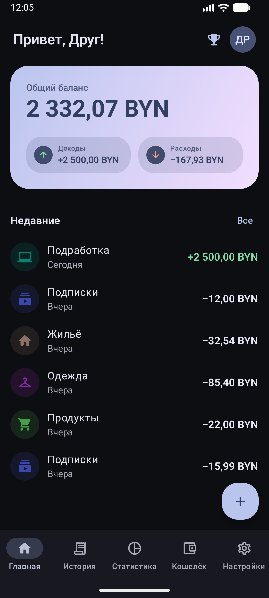
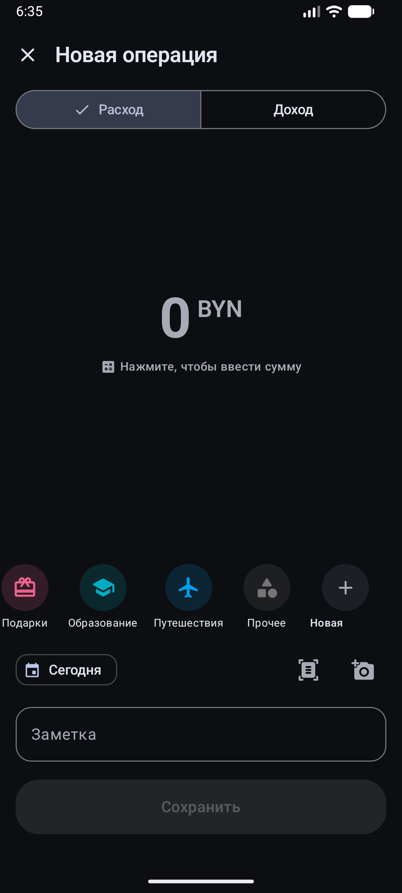
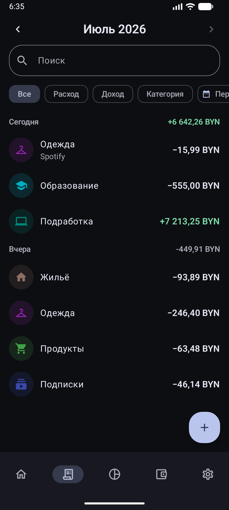
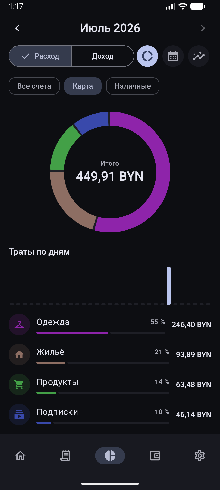
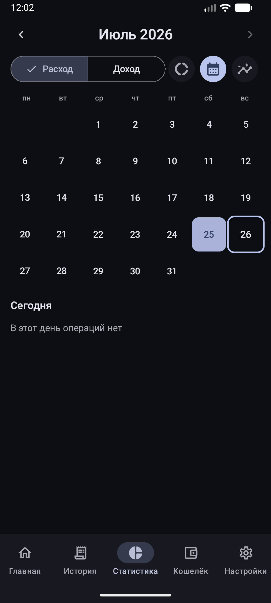
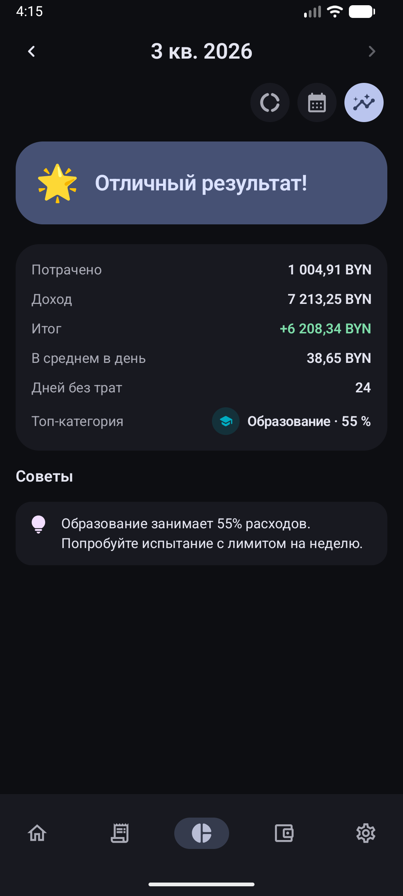
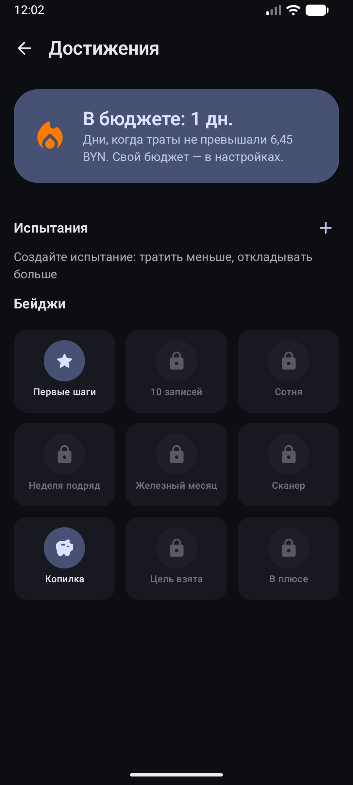
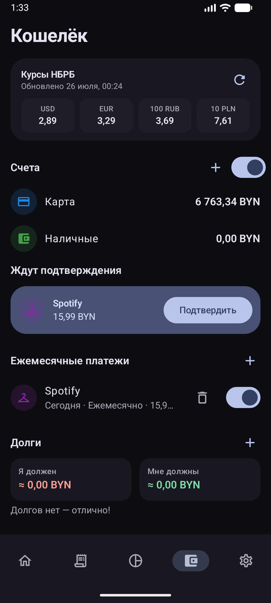
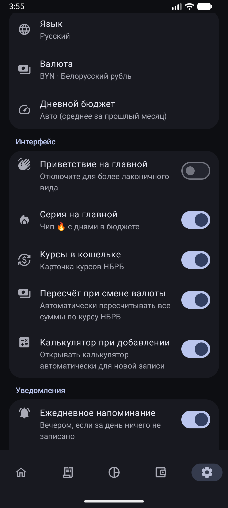

# 💚 Kosht — Personal Finance, Done Right

**Track spending in seconds. See where your money goes. Actually save.**

Kosht is a beautifully crafted personal finance app for Android that turns money tracking from a chore into a habit you'll enjoy. No accounts, no subscriptions, no cloud — your data never leaves your phone.

---

## ✨ Highlights

<table>
  <tr>
    <td align="center"> <b>Everything at a glance</b></td>
    <td align="center"> <b>Add a record in 3 taps</b></td>
    <td align="center"> <b>Powerful history & filters</b></td>
  </tr>
  <tr>
    <td align="center"> <b>Charts that make sense</b></td>
    <td align="center"> <b>Spending heatmap calendar</b></td>
    <td align="center"> <b>Monthly report & tips</b></td>
  </tr>
  <tr>
    <td align="center"> <b>Streaks, challenges, badges</b></td>
    <td align="center"> <b>Debts, savings & live FX</b></td>
    <td align="center"> <b>Make it truly yours</b></td>
  </tr>
</table>

---

## 🚀 Key Features

### ⚡ Lightning-fast expense tracking
A clean editor, smart category carousel and haptic feedback make adding a transaction take literal seconds. Attach a photo of the receipt to any expense.

### 🧮 Calculator, zero taps away
Adding a record drops you straight into a roomy bottom-sheet calculator — the editor itself stays uncluttered, and tapping the amount brings it back any time. Type `12,50+3,90+8`, hit the smart **=** to evaluate (with proper operator precedence), and **Apply** writes the sum into the amount field.

### 💳 Multiple accounts
Cards, cash, whatever you use. One account by default keeps the app dead simple; add more and Kosht unlocks per-account balances on Home, an account picker in the editor, an account choice when confirming a recurring payment and an account filter in Statistics. Tap an account to set its real balance, or use the pencil to rename it and change its icon and color.

### 📸 Receipt scanning — fully offline
Snap a photo of a receipt and Kosht reads the total, date and store name for you, then attaches the photo to the record. Recognition runs 100% on your device — receipts never leave your phone. Review and correct anything before saving.

### 📊 Statistics three ways
- **Charts** — an animated category donut and daily spending bars
- **Calendar heatmap** — instantly spot your expensive days
- **Report, on your terms** — set the window (week, month, quarter, year) and the visible metric rows once in Settings, then just walk back through past periods with the arrows; every metric is compared with the previous period of the same length. Plus personalized rule-based tips ("Groceries take 45% of spending — try a weekly limit challenge")

### 💱 Multi-currency done right
- **Live official rates** from the National Bank, refreshed automatically or by hand — with the update time always visible
- Amounts in foreign currency show their **BYN equivalent everywhere**: debts, savings, recurring charges
- Every expense **freezes the rate at the moment you paid**, so history never drifts when rates move
- **Switch the app currency** and every stored amount is converted at the live rate in one tap (or turn auto-convert off — your choice)
- Foreign-currency recurring payments let you set the **exact rate you were charged**

### 👛 The Wallet
- **Debts** — who owes whom, in any currency, with partial repayments
- **Savings** — a journal of every "set aside" moment, with per-currency totals
- **Savings goals** — name a goal, set a target, watch the progress bar fill 🎉
- **Recurring payments** — pick the charge date and frequency; nothing is charged silently, you always confirm. Foreign-currency charges let you set the exact rate, and with several accounts you pick which one to pay from.

### 🏆 Gamification that helps, not annoys
- **Under-budget streak** — days in a row you stayed within your daily budget (auto-calculated or set your own)
- **Custom challenges** — "spend under 100 on eating out this week", "no-spend weekend", "save 200 this month" — you configure, Kosht tracks, and a tap re-opens any challenge for editing
- **18 awards**, from first steps to a 100-day streak, laid out as swipeable pages. Tap one to see how to earn it, how far along you are ("6 / 10"), and the day you earned it — once earned, it is yours forever

### 🔔 Smart notifications (all optional)
An evening nudge only if nothing is logged, recurring payments awaiting confirmation, and a Monday money digest. All of them are quiet by design — no heads-up popups, no forced sound — and a tap takes you straight into the app.

### 🎨 Made for you
Light & dark themes, Material You dynamic colors, English & Russian interface, a profile with photo or built-in avatars — and interface toggles to hide anything you don't need. Your data stays on your device. Always.

### 📖 Learn it in minutes
An illustrated **guide lives right inside Settings**, and a full **PDF manual** with screenshots is one tap away (also in [`docs/MANUAL.pdf`](docs/MANUAL.pdf)).

---

## 📦 Download & Updates

Every push to `master` automatically builds a fresh APK. You do not have to watch the repo: tap **Settings → Version** and Kosht checks the latest release for you — it either confirms you are up to date or offers the new APK for download (offline it simply says the check is unavailable). You can still grab builds by hand from the **[Releases](../../releases)** page.

Requires Android 8.0+.

*See [PUBLISHING.md](PUBLISHING.md) for the Google Play / AppGallery release guide.*
